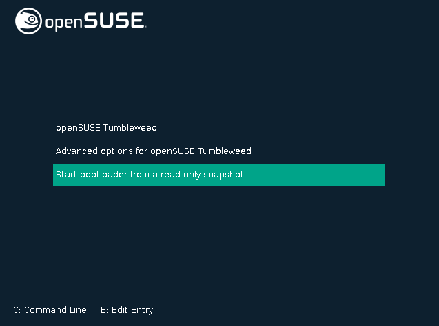

## Snapper
Snapper is a command-line program for filesystem snapshot management. It can create, delete and compare snapshots and undo changes done between snapshots.

### Choosing a Snapshot
#### Snapshot Types
Snapper features 3 types of snapshots: Timeline, Installation, and Administration.

* __Timeline__ snapshots are single snapshots, created every hour and old snapshots are automatically deleted. Disabled by default, the only single snapshots present may be the ones created when openSUSE was installed.
* __Installation__ snapshots are created in pairs (Pre and Post) when packages are installed with YaST or Zypper. Snapshot pairs are marked as __important__ if an important system component, such as the kernel, has been installed. Enabled by default.
* __Administration__ snapshots are created in pairs (Pre and Post) when system administration is performed using YaST. The Pre snapshot is created when a YaST module is started and the Post snapshot is created when the module is closed. Enabled by default.

!!! note
    The last ten important and the last ten regular snapshot pairs are kept. This total encompasses both Installation and Administration snapshot types.

#### Identifying Snapshots

There are two ways to identify which snapshot you may want to rollback to: snapper command line and YaST Filesystem Snapshots

Snapper Command Line:

`$ sudo snapper list`

??? example "Snapper CLI Example"
    ```
    $ sudo snapper list
    [sudo] password for root: 
      # | Type   | Pre # | Date                            | User | Cleanup | Description           | Userdata     
    ----+--------+-------+---------------------------------+------+---------+-----------------------+--------------
     0  | single |       |                                 | root |         | current               |              
     1* | single |       | Thu 17 Dec 2020 10:59:10 PM MST | root |         | first root filesystem |              
     2  | single |       | Fri 18 Dec 2020 12:02:05 AM MST | root | number  | after installation    | important=yes
    39  | pre    |       | Sat 19 Dec 2020 01:58:34 PM MST | root | number  | zypp(zypper)          | important=no 
    40  | post   |    39 | Sat 19 Dec 2020 01:58:54 PM MST | root | number  |                       | important=no 
    41  | pre    |       | Sat 19 Dec 2020 01:59:02 PM MST | root | number  | zypp(zypper)          | important=no 
    42  | post   |    41 | Sat 19 Dec 2020 01:59:59 PM MST | root | number  |                       | important=no 
    43  | pre    |       | Sun 20 Dec 2020 05:30:27 PM MST | root | number  | yast firewall         |              
    44  | pre    |       | Sun 20 Dec 2020 05:31:17 PM MST | root | number  | yast firewall         |              
    45  | post   |    43 | Sun 20 Dec 2020 05:31:17 PM MST | root | number  |                       |              
    46  | post   |    44 | Sun 20 Dec 2020 05:31:38 PM MST | root | number  |                       |              
    47  | pre    |       | Sun 20 Dec 2020 05:36:25 PM MST | root | number  | zypp(zypper)          | important=no 
    48  | post   |    47 | Sun 20 Dec 2020 05:37:00 PM MST | root | number  |                       | important=no 
    49  | pre    |       | Tue 22 Dec 2020 07:40:20 PM MST | root | number  | yast snapper          |              
    50  | pre    |       | Tue 22 Dec 2020 07:42:33 PM MST | root | number  | zypp(zypper)          | important=yes
    51  | post   |    50 | Tue 22 Dec 2020 07:46:28 PM MST | root | number  |                       | important=yes
    ```
YaST Filesystem Snapshots:


!!! note
    As snapshots are viewed, Snapper will create more snapshots, because Administrative tasks are being performed. 
    
Moving forward with the assumption there was an issue with the last Zypper update, #47 is chosen as the snapshot to recover.
### Initiating Rollback
Upon identification of a recovery snapshot, reboot openSUSE. At the boot menu, scroll down to, and select, __Start bootloader from a read-only snapshot__.



On the Read-only Snapshot menu, scroll down to, and select, snapshot #47. openSUSE will appear to boot as normal.

!!! tip
    There isn't a scroll indicator on the Read-only Snapshot Menu, but it is possible to scroll down to select more options, if available.


### Finalizing Rollback
Once openSUSE is booted, the rollback is completed by running:

`$ sudo snapper rollback`

openSUSE should then be rebooted and the recovered snapshot will be the new default boot option.

??? note "Snapper Resources"
    
    * [Snapper.io](http://snapper.io "Snapper.io")
    * [openSUSE Wiki Portal:Snapper](https://en.opensuse.org/Portal:Snapper "openSUSE Wiki Portal:Snapper")
