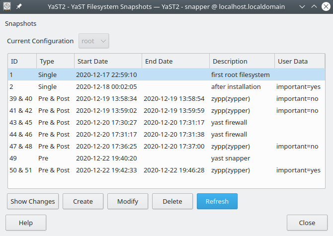
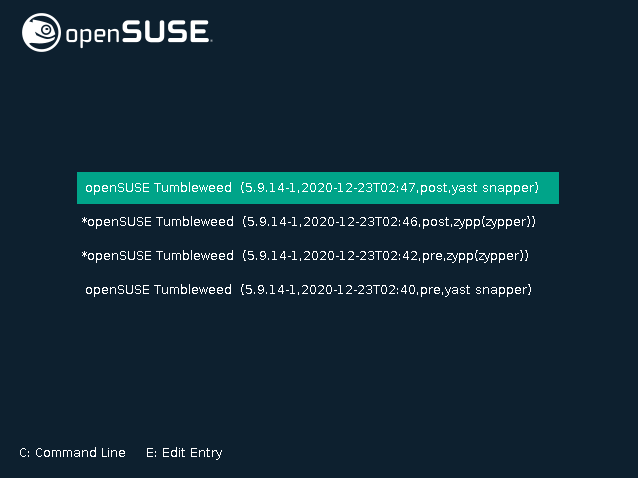

## Snapper
Snapper is a command-line and YaST interface for filesystem snapshot management. It can create, delete and compare snapshots and undo changes done between snapshots.

#### Snapper capabilities
- Undo system changes made by `zypper` and YaST.
- Restore files from previous snapshots.
- Do a system rollback by booting from a snapshot.
- Manually create and manage snapshots, within the running system.

!!! info "Snapshots"
	By default, the root partition (/) of openSUSE Leap and Tumbleweed is formatted with Btrfs. Taking snapshots is automatically enabled if the root partition (/) is big enough (more than approximately 16 GB). By default, snapshots are disabled on partitions other than root (/).

### Choosing a Snapshot
#### Snapshot Types
`snapper` features 3 types of snapshots: _Timeline_, _Installation_, and _Administration_.

* __Timeline__ snapshots are single snapshots, created every hour and old snapshots are automatically deleted. Disabled by default, the only single snapshots present may be the ones created when openSUSE was installed.
* __Installation__ snapshots are created in pairs (_Pre_ and _Post_) when packages are installed with _YaST_ or `zypper`. Snapshot pairs are marked as __important__ if an important system component, such as the kernel, has been installed. Enabled by default.
* __Administration__ snapshots are created in pairs (_Pre and Post_) when system administration is performed using _YaST_. The Pre snapshot is created when a _YaST_ module is started and the Post snapshot is created when the module is closed. Enabled by default.

!!! note
    The last ten important and the last ten regular snapshot pairs are kept. This total encompasses both Installation and Administration snapshot types. Snapshots are automatically deleted when they take up too much space on the disk, but four important and two regular snapshots are always kept.

#### Identifying Snapshots

There are two ways to identify which snapshot you may want to rollback to: 
* with the `snapper` command line utility
* with the _YaST_ utility at _YaST_ > _Filesystem Snapshots_

Snapper command line:

`$ sudo snapper list`

__Snapper CLI Example__
```
    $ sudo snapper list
    [sudo] password for root: 
      # | Type   | Pre # | Date                            | User | Cleanup | Description           | Userdata     
    ----+--------+-------+---------------------------------+------+---------+-----------------------+--------------
     0  | single |       |                                 | root |         | current               |              
     1* | single |       | Thu 17 Dec 2020 10:59:10 PM MST | root |         | first root filesystem |              
     2  | single |       | Fri 18 Dec 2020 12:02:05 AM MST | root | number  | after installation    | important=yes
    39  | pre    |       | Sat 19 Dec 2020 01:58:34 PM MST | root | number  | zypp(zypper)          | important=no 
    40  | post   |    39 | Sat 19 Dec 2020 01:58:54 PM MST | root | number  |                       | important=no 
    41  | pre    |       | Sat 19 Dec 2020 01:59:02 PM MST | root | number  | zypp(zypper)          | important=no 
    42  | post   |    41 | Sat 19 Dec 2020 01:59:59 PM MST | root | number  |                       | important=no 
    43  | pre    |       | Sun 20 Dec 2020 05:30:27 PM MST | root | number  | yast firewall         |              
    44  | pre    |       | Sun 20 Dec 2020 05:31:17 PM MST | root | number  | yast firewall         |              
    45  | post   |    43 | Sun 20 Dec 2020 05:31:17 PM MST | root | number  |                       |              
    46  | post   |    44 | Sun 20 Dec 2020 05:31:38 PM MST | root | number  |                       |              
    47  | pre    |       | Sun 20 Dec 2020 05:36:25 PM MST | root | number  | zypp(zypper)          | important=no 
    48  | post   |    47 | Sun 20 Dec 2020 05:37:00 PM MST | root | number  |                       | important=no 
    49  | pre    |       | Tue 22 Dec 2020 07:40:20 PM MST | root | number  | yast snapper          |              
    50  | pre    |       | Tue 22 Dec 2020 07:42:33 PM MST | root | number  | zypp(zypper)          | important=yes
    51  | post   |    50 | Tue 22 Dec 2020 07:46:28 PM MST | root | number  |                       | important=yes

```
__Snapper YaST interface example__



!!! note
    As snapshots are viewed, `snapper` will create more snapshots, because administrative tasks are being performed. 
    
Moving forward with the assumption there was an issue with the last `zypper` update, #47 is chosen as the snapshot to recover.
### Initiating Rollback
Upon identification of a recovery snapshot, reboot openSUSE. At the boot menu, scroll down to, and select, __Start bootloader from a read-only snapshot__.


On the Read-only Snapshot menu, scroll down to, and select, the desired recovery snapshot. Snapshot #47 is used here as an example. openSUSE will appear to boot as normal.

!!! tip
    There isn't a scroll indicator on the Read-only Snapshot Menu, but it is possible to scroll down to select more options, if available.


### Finalizing Rollback
Once your system has booted, the rollback is completed by running:

`$ sudo snapper rollback`

Your system should then be rebooted and the recovered snapshot will be the new default boot option.

??? note "Snapper Resources"
    
    * [Snapper.io](http://snapper.io "Snapper.io")
    * [openSUSE Wiki Portal:Snapper](https://en.opensuse.org/Portal:Snapper "openSUSE Wiki Portal:Snapper")
